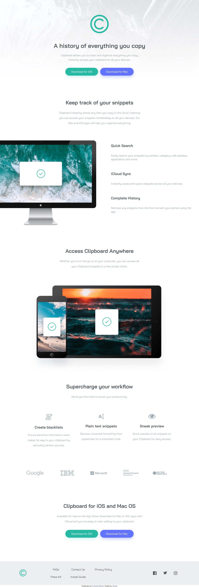

# Frontend Mentor - Clipboard landing page solution

This is a solution to the [Clipboard landing page challenge on Frontend Mentor](https://www.frontendmentor.io/challenges/clipboard-landing-page-5cc9bccd6c4c91111378ecb9). Frontend Mentor challenges help you improve your coding skills by building realistic projects. 

## Table of contents

- [Overview](#overview)
  - [The challenge](#the-challenge)
  - [Screenshot](#screenshot)
  - [Links](#links)
  - [Built with](#built-with)
  - [What I learned](#what-i-learned)
  - [Continued development](#continued-development)
  - [Useful resources](#useful-resources)
- [Author](#author)
- [Acknowledgments](#acknowledgments)

## Overview

### The challenge

Users should be able to:

- View the optimal layout for the site depending on their device's screen size
- See hover states for all interactive elements on the page

### Screenshot

### Links

- Live Site URL: [clipboard-landing-page-master](https://clipboard-landing-page-master1.netlify.app)

### Built with

- Semantic HTML5 markup
- CSS custom properties
- Flexbox
- CSS Grid
- Mobile-first workflow

### What I learned

In this project, I gained more knowledge about CSS grid and flex properties. 

### Continued development

I'll make sure to keep improving on this web dev path at large

### Useful resources

- [w3schools](https://www.w3schools.com) - This website really helped me as a beginner. I have really improved, thanks to them.

## Author

-  Frontend Mentor - [@jibreel1](https://www.frontendmentor.io/profile/jibreel1)
-  Twitter - [@jibreel1005](https://www.twitter.com/jibreel1005)

## Acknowledgments

I'll like to thank the MAMIT team for their continous help and support towards this project and others I'll be doing in the future😉
